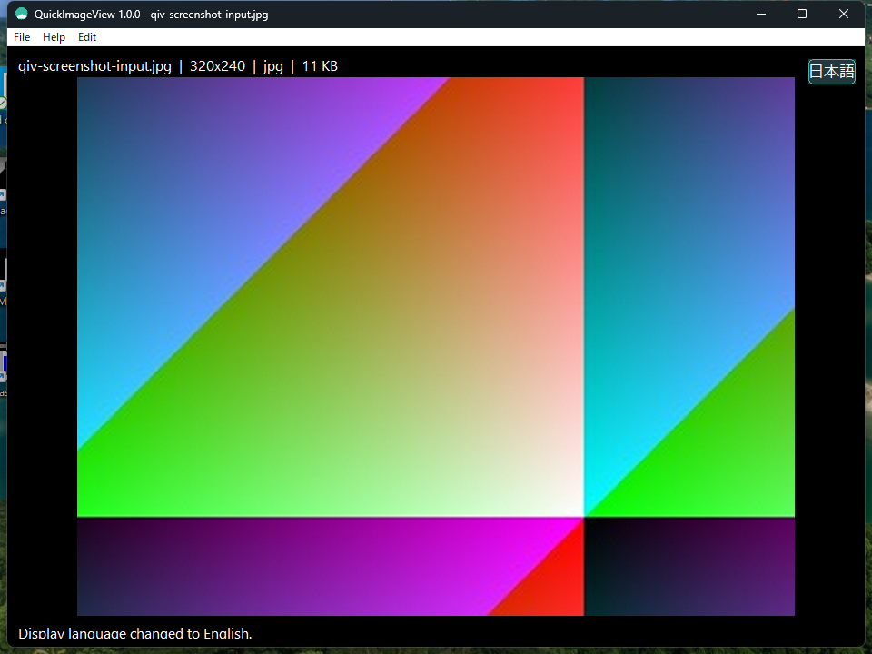

# QuickImageView

[Japanese README](README_jp.md)

QuickImageView is a lightweight Windows image viewer and editor. The following
requirements are the single source scope for the 72-item baseline and the
additional completion and distribution checks. A requirement is not complete
until the integrated UI/release verification records evidence for it.

<p align="center"></p>

The release ZIP and MSI include the executable, Japanese and English README,
history, help, MIT License, libwebp COPYING/PATENTS, and the Japanese license
notice. MSI registration and each image-extension association are independent
optional features; all associations are unselected by default.

The repository root keeps the canonical README and history files. `document/`
keeps specifications and developer documents. `resources/help/` keeps the
bilingual help sources that are embedded into the executable. `dist/documents/`
contains the distribution README, history, license, and third-party notice
files; `dist/binary/` contains binaries only.

## View and basic operation

- Open and display an image from the command line or the File menu
- Open an image by dragging it onto the window after startup; when an image is already displayed, confirm before replacing it
- Load images available to Windows through WIC
- Fit the image inside the window
- Zoom in and out with the mouse wheel
- Pan with a middle-button drag
- Render smoothly without flicker while zooming or panning
- Select a region with a left-button drag
- Show the selected pixel size at the upper-left of the selection
- Display the selection and crop it from the context menu
- Display the file name, image dimensions, format, and file size
- Display representative EXIF fields such as make, model, and capture date when present
- Display file information, EXIF information, and operation messages in black-background, white-text information bars
- Use the Windows standard Segoe UI font for application text
- Switch between Japanese and English with the upper-right button
- Display EXIF information in a floating window that does not overlap the image
- Display EXIF make, model, capture date, and other available text directly in the EXIF window
- Copy the EXIF text to the clipboard from the EXIF window
- Display an explicit “no EXIF” state in the floating window when no EXIF exists
- Verify EXIF through UI controls and clipboard contents, not OCR

## Resize

- Open the resize dialog from the Edit menu and the context menu
- Specify any positive percentage
- Specify any positive pixel width and height
- Show an aspect-ratio lock option
- Enable the aspect-ratio lock by default
- Reflect resize results in both image data and the on-screen display size
- Reflect the new dimensions on screen when resizing while zoomed in

## Image editing

- Rotate by 90, 180, or 270 degrees
- Mirror horizontally
- Flip vertically
- Convert to full color
- Convert to 256 colors
- Convert to grayscale
- Undo with `Ctrl+Z`
- Redo with `Ctrl+Y`
- Do not expose Undo/Redo as menu items
- Preserve the pre-edit image state for Undo
- Discard the Redo history when a new edit is made

## Clipboard

- Copy the image from the Edit menu
- Copy the image from the context menu
- Copy the image with `Ctrl+C`
- Copy only the selected area when a selection is active
- Paste an image from the Edit menu
- Paste an image from the context menu
- Paste an image with `Ctrl+V`
- Handle Windows image clipboard formats
- Handle `CF_BITMAP`, `CF_DIB`, and `CF_DIBV5`
- Place a pasted image as an original-scale overlay on the source image
- Move the pasted image within the source image and use context-menu OK to commit or Retry to continue moving it
- Display the committed paste as the current image
- Undo the state from before the paste

## Save and convert

- Do not modify, delete, or overwrite the source image
- Show save options before Save As
- Select the output format before selecting the destination folder
- Specify JPEG quality
- Allow arbitrary JPEG quality values, not only fixed presets
- Specify PNG compression level
- Specify WebP quality
- Specify HEIC/HEIF quality
- Enable only the quality and compression options available for the selected format
- Show the extension filter for the selected format
- Add the selected format's extension when the file name has none
- Save and convert to JPEG, PNG, TIFF, BMP, and GIF
- Save and convert to WebP when the Windows WIC codec is available
- Save and convert to HEIC/HEIF when the Windows WIC codec is available
- Reject saving to the same path
- Reject overwriting an existing file
- Guarantee that the source file is unchanged by conversion
- After a successful conversion, reload the destination file without a confirmation prompt and show it as the current image

The command-line conversion form is:

```powershell
 .\dist\binary\QuickImageView.exe --convert C:\path\to\source.png C:\path\to\output.bmp
```

## Windows integration

- Allow registration in the image context menu during installation
- Limit context-menu registration to the current user (HKCU)
- Point the registration command to the installed QuickImageView.exe
- Make it available under “Show more options” on Windows 11
- Provide an installation option with no registration
- Remove only QuickImageView's own registration during uninstall
- Do not remove registrations belonging to other applications
- Open an image by launching the installed executable

## Completion and distribution checks

- Display the entire application with the required dark theme
- Display the title bar with the required dark theme
- Display the menu bar and menu items with the required dark theme
- Display the Japanese/English switch as a dedicated dark UI control
- Open the EXIF window from the application menu
- Open the bundled help from the application Help menu
- Open the dark About dialog from Help > About
- Open both Japanese and English help
- Keep help content synchronized with implemented behavior
- Keep the English and Japanese README requirements, constraints, and procedures synchronized
- Keep the English and Japanese specifications synchronized
- Keep the English and Japanese distribution READMEs synchronized
- Keep the English and Japanese histories synchronized
- Include MIT License and libwebp COPYING/PATENTS in the distribution
- Document supported formats and the Windows-side WIC codec dependency
- Generate the MSI from the Release executable
- Include the executable, help, bilingual documents, and licenses in the MSI
- Make MSI Explorer registration optional
- Make MSI file associations optional per extension
- Install the MSI with no associations selected by default
- Open images and bundled help from the installed executable
- Remove only QuickImageView's own registrations during uninstall
- QuickImageViewのアイコンを実行ファイルとインストール済みアプリへ適用する
- Quickアプリのテンプレートに沿ったフォルダー構成を維持する
- 日英切替後にメニュー、情報帯、ダイアログ、ヘルプの表示言語を切り替える
- アプリ内ヘルプの導線を実装し、インストール後のEXEからヘルプを開ける
- 英日README、仕様、ヘルプ、配布文書、履歴の参照先ファイルを配布物に揃える
- 配布用READMEに取得URL、SHA-256、免責事項、インストール手順を記載する
- 日本語ライセンス文書を配布物とMSIへ同梱する
- `dist/documents/`には配布用README、履歴、ライセンス、libwebp文書を集約し、`dist/binary/`にはバイナリだけを置く
- MSIの画像拡張子関連付けを各拡張子の独立したFeatureとして選択できる
- ダークテーマをダイアログ、情報帯、ステータスバーにも適用する
- 旧EXIF情報帯を画像本体の表示へ残さず、フローティング表示へ移行する
- 日英UIの実スクリーンショットを`assets/`へ同梱する

## Out of scope

The following are out of scope.

- Explorer thumbnail shell extensions
- Previous/next navigation through a folder
- Slide shows
- Printing
- EXIF or metadata editing
- Direct saving over the source image
- Persisting historical verification results, work logs, or loop history

## Build environment

- Windows 10 or Windows 11
- CMake 3.20 or later
- MinGW-w64 C++17 toolchain
- PowerShell 7.6.5 or later

No additional image-processing SDK is required for the normal build because it uses WIC. WebP, HEIC, and HEIF are available only when the corresponding Windows codecs are installed.

QuickImageView can open BMP, GIF, ICO, JPEG, JPEG XR, PNG, TIFF, Windows Media
Photo, DDS, WebP, HEIC, and HEIF when the corresponding WIC decoder is present.
The Open dialog exposes JPG/JPEG, PNG, TIFF, BMP, GIF, WebP, HEIC, and HEIF.

## Build

```powershell
cmake -S . -B build/native -G "MinGW Makefiles"
cmake --build build/native
ctest --test-dir build/native --output-on-failure
```

Alternatively, run:

```powershell
.\build.bat
```

## Run

```powershell
.\dist\binary\QuickImageView.exe C:\path\to\image.png
```

## PowerShell installation

```powershell
pwsh -NoProfile -ExecutionPolicy Bypass -File .\scripts\install.ps1
```

To register the optional context menu, pass `-RegisterContextMenu`:

```powershell
pwsh -NoProfile -ExecutionPolicy Bypass -File .\scripts\install.ps1 -RegisterContextMenu
```

## Uninstall

```powershell
pwsh -NoProfile -ExecutionPolicy Bypass -File .\scripts\uninstall.ps1
```

## Create a distribution package

```powershell
pwsh -NoProfile -ExecutionPolicy Bypass -File .\scripts\package.ps1
```

The default package output directory is `build/package/`; final binaries remain in `dist/binary/`.

## License

QuickImageView is distributed under the MIT License. See [LICENSE](LICENSE).

WebP encoding uses libwebp 1.6.0. See [document/third_party_licenses.md](document/third_party_licenses.md), [document/third_party_licenses_jp.md](document/third_party_licenses_jp.md), and `third_party/libwebp-1.6.0/` for third-party license and patent notices.

## Verification status

The repository is not release-complete until the single integrated verification
ledger covers the 72 baseline features together with the completion and
distribution requirements above. The current checkout still has pending UI,
help, document, and MSI verification; this README does not declare those items
as passed.
