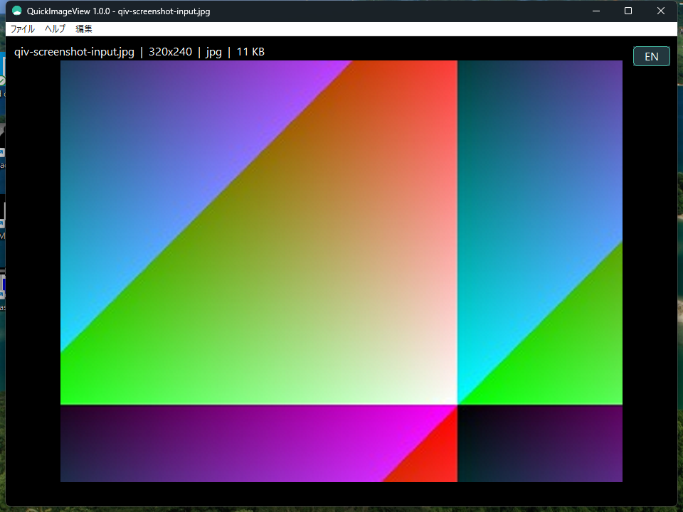

# QuickImageView

[English README](README.md)

Windows向けの軽量画像ビューアー・画像編集アプリです。日本語と英語を切り替えながら、画像の表示、編集、クリップボード操作、別形式保存を行えます。

<p align="center"></p>

## 配布版を使う

配布版はGitHub ReleasesのZIPまたはMSIで提供します。ZIPには実行ファイル、日英の説明書・履歴、MIT License、libwebpのCOPYING/PATENTS、日英ヘルプを同梱します。MSIでは右クリック登録と拡張子関連付けを個別に選択でき、既定では関連付けを行いません。

## 表示と基本操作

- コマンドラインまたはファイルメニューから画像を開いて表示する
- 起動後に画像ファイルをウィンドウへドラッグ＆ドロップして開く（画像表示中は確認後に現在の画像を閉じて開く）
- Windowsで利用可能な画像をWIC経由で読み込む
- ウィンドウ内に画像をフィット表示する
- マウスホイールで拡大・縮小する
- 中ドラッグでパンする
- 拡大・縮小・パン中も画像をちらつかせず滑らかに描画する
- 左ドラッグで範囲を選択する
- 選択枠の左上に選択サイズをピクセル単位で表示する
- 選択範囲を表示し、右クリックメニューから切り抜く
- ファイル名、画像寸法、形式、ファイルサイズを表示する
- EXIFが存在する場合、メーカー、機種、撮影日時など代表的な情報を表示する
- ファイル情報・EXIF情報・操作メッセージを黒背景・白文字の情報帯へ表示する
- アプリの表示文字にWindows標準のSegoe UIを使用する
- 右上のボタンで日本語とEnglishの表示を切り替える
- EXIF情報を画像本体と重ならないフローティングウィンドウへ表示する
- EXIF情報ウィンドウにメーカー、機種、撮影日時などの表示テキストを直接表示する
- EXIF情報ウィンドウのコピー操作でEXIFテキストをクリップボードへ格納する
- EXIFが存在しない場合も、EXIFなしであることをフローティングウィンドウへ表示する
- EXIF情報の確認はOCRではなく、UIコントロールとクリップボード内容を検査する

## リサイズ

- 編集メニューおよび右クリックメニューからリサイズ指定ダイアログを開く
- 任意の正のパーセントを指定する
- 任意の正のピクセル幅・高さを指定する
- アスペクト比固定オプションを表示する
- アスペクト比固定は初期状態でONにする
- リサイズ後は画像データだけでなく、画面上の表示サイズにも結果を反映する
- 拡大表示中にリサイズしても、リサイズ後の寸法変化が画面に反映される

## 画像編集

- 90度、180度、270度回転する
- 左右反転（ミラー）する
- 上下反転する
- フルカラーへ変換する
- 256色へ変換する
- グレースケールへ変換する
- `Ctrl+Z` でUndoする
- `Ctrl+Y` でRedoする
- Undo／Redoをメニュー項目として表示しない
- 編集前の画像状態をUndo用に保持する
- 新しい編集を行った場合、Redo履歴を破棄する

## クリップボード

- 編集メニューから画像をコピーする
- 右クリックメニューから画像をコピーする
- `Ctrl+C` で画像をコピーする
- 範囲選択中にコピーした場合は、選択範囲だけをコピーする
- 編集メニューから画像を貼り付ける
- 右クリックメニューから画像を貼り付ける
- `Ctrl+V` で画像を貼り付ける
- Windowsの画像クリップボード形式を扱う
- `CF_BITMAP`、`CF_DIB`、`CF_DIBV5`を扱う
- 貼り付けた画像を元画像に重ねて原寸で仮配置する
- 貼り付け画像を元画像の範囲内で移動し、右クリックメニューのOKで確定またはやり直しで移動を継続する
- 貼り付けを確定した画像を現在の画像として表示する
- 貼り付け前の状態をUndoできる

## 保存と変換

- 原本を変更、削除、上書きしない
- 名前を付けて保存する前に保存オプションを表示する
- 保存先フォルダーの選択前に、保存形式を選択する
- JPEG品質を指定する
- JPEG品質は固定候補だけでなく任意の値を指定できる
- PNG圧縮レベルを指定する
- WebP品質を指定する
- HEIC/HEIF品質を指定する
- 保存形式に応じて使用可能な品質・圧縮オプションだけを有効にする
- 保存形式に応じた拡張子フィルターを表示する
- 拡張子が省略された場合、選択した形式の拡張子を補う
- JPEG、PNG、TIFF、BMP、GIFへ保存・変換する
- WindowsのWICコーデックが利用可能な場合、WebPへ保存・変換する
- WindowsのWICコーデックが利用可能な場合、HEIC/HEIFへ保存・変換する
- 同一パスへの保存を拒否する
- 既存ファイルへの上書きを拒否する
- 変換元ファイルを変更しないことを保証する
- 別形式で保存に成功した場合、保存先ファイルを確認なしで再読み込みして現在の画像として表示する

## Windows連携

- インストール時に画像ファイルの右クリックメニューへ登録できる
- 右クリックメニュー登録は現在のユーザー（HKCU）に限定する
- 登録コマンドはインストール先のQuickImageView.exeを指す
- Windows 11では「その他のオプションを表示」内から利用できる
- 登録なしでインストールできるオプションを用意する
- アンインストール時はQuickImageView専用の登録だけを削除する
- 他のアプリケーションの登録を削除しない
- インストールした実行ファイルを起動して画像を開ける

## 完成・配布検査

- アプリ全体をダークテーマで表示する
- タイトルバーをダークテーマで表示する
- メニューバーとメニュー項目をダークテーマで表示する
- 日英切替ボタンをダークな専用UIとして表示する
- EXIF情報ウィンドウをアプリのメニューから開ける
- アプリのヘルプメニューから同梱ヘルプを開ける
- 日本語ヘルプと英語ヘルプをそれぞれ開ける
- ヘルプの説明が実装済み機能と一致する
- 英語READMEと日本語READMEの機能・制約・手順が同期している
- 英語仕様書と日本語仕様書の機能・制約・手順が同期している
- 英語配布READMEと日本語配布READMEの内容が同期している
- 英語履歴と日本語履歴の内容が同期している
- MIT LicenseとlibwebpのCOPYING・PATENTSを配布物へ同梱する
- 対応形式とWindows側のWICコーデック依存を文書へ記載する
- MSIをRelease版EXEから生成できる
- MSIへEXE、ヘルプ、日英文書、ライセンスを同梱する
- MSIの右クリック登録を任意選択としてインストールできる
- MSIの拡張子関連付けを拡張子ごとに任意選択できる
- MSIを既定の関連付けなしでインストールできる
- MSIインストール後のEXEから画像とヘルプを開ける
- 日英UIの実スクリーンショットを`assets/`へ同梱する

## 実装しない機能

- Explorerのサムネイル表示用シェル拡張
- フォルダー内画像の前後移動、スライドショー、印刷
- EXIF・メタデータの編集
- 画像ファイルの原本への直接保存
- 過去の検査結果、作業ログ、ループ履歴の保存

## 対応形式と依存関係

Windows Imaging Component（WIC）の対応デコーダーが利用できる場合、BMP、GIF、ICO、JPEG、JPEG XR、PNG、TIFF、Windows Media Photo、DDS、WebP、HEIC、HEIFを開けます。WebPとHEIF/HEICはWindows側の追加コーデックに依存します。

## ビルドと検査

```powershell
cmake -S . -B dist/binary -G "MinGW Makefiles"
cmake --build dist/binary
ctest --test-dir dist/binary --output-on-failure
python .\python\tests\run_loop.py
```

検査はビルド、インストール版の実UI操作、CTest、`--self-test`、配布物を順に確認します。FAIL、ERROR、UNCHECKEDが1件でもあれば未完成です。

## ライセンス

QuickImageViewはMIT Licenseで配布します。原本ライセンスと第三者通知はルート、`document/`、`third_party/`を参照してください。`dist/documents/`は配布用READMEだけを置き、ビルド時に履歴・ライセンス・ヘルプを`dist/binary/`へ集約します。
